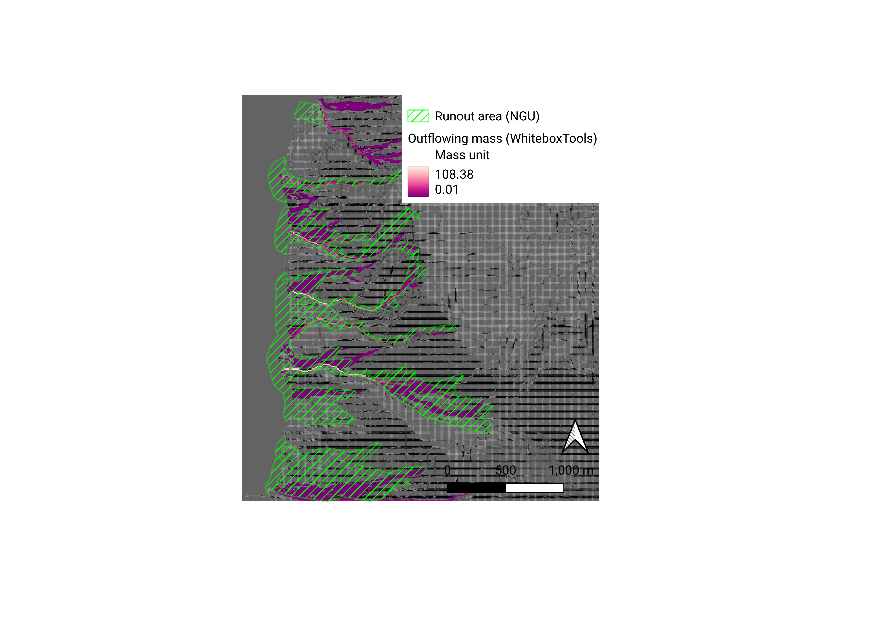

# Runout analysis of debris flows

This repository documents the development of runout models of debris flows. It is under active development as of 2023-05-02.

### 1. Task

The task is to present my approach to runout modelling of debris flows using Python.

### 2. Procedure

My approach is divided into the following two parts:

1. ("Approach A") A runout analysis with the same tools I used for my Master's thesis. This can be seen as a sequel to my thesis in which I modelled potential starting cells of landslides.

2. ("Approach B") A runout analysis using NGU's methodology [1], which is based on Horton et al.'s study from Switzerland [2].

### 3. Repository structure

This repository was created with the [poetry dependency and packaging manager](https://python-poetry.org/).

- *whitebox_solution/* contains a completed runout analysis using Approach A.
- *showcase/* is the directory for the Python package implementing Approach B (development started 2023-05-04)
- *tests/* contains unit tests of the *showcase* package
- *data/* and *fig/* contain geographical data and figures (data not uploaded to GitHub due to file size constraints)
- *pyproject.toml* can be used to recreate the Python environment

### 4. Scientific background

Modelling debris flow runouts requires a flow analysis of the terrain raster and the consideration of friction losses in the energy equation when mass is moving downstreams, which eventually will cause debris flows to stop.

The following table summarizes the differences between Approaches A and B:

|  | Approach A | Approach B |
| ----------- | ----------- | ----------- |
| **Flow analysis** | D-Inf | Multiple Flow Direction, persistence |
| **Friction losses** | Efficiency, absorption | Maximum runout angle, kinetic energy limit |

#### 4.1 Approach A

The D-Inf flow algorithm permits flow to up to two child cells, but is too restrictive according to [2] in that it does not represent the extend of landslide fans well. This can also be seen in this analysis with Approach A when compared to NGU's runout map (see figure, taken from the Jupyter notebook *whitebox_solution/analysis.ipynb*). Runout paths are rather narrow even at shallower angles, while NGU's map shows a distinct formation of fans.

Approach A models energy losses acoording to the following equation [3]:

`Outflowing Mass = (Loading - Absorption + Inflowing Mass) × Efficiency`

*Absorption* and *efficiency* are explained in the Jupyter notebook *whitebox_solution/analysis.ipynb*.

#### 4.2 Approach B

Approach B is described in detail in [1], [2].

The Multiple Flow Direction (MFD) algorithm allows for flow towards all cells that are not parent cells. Persistence weights route mass along the incoming direction of mass flux. In NGU's analysis, mass flux can be routed towards up to five child cells, resulting in a higher likelihood of fan spread (contrary to D-Inf which allows little spread). The energy height is limited by the potential energy in the starting cell and a maximum runout angle.

Having conducted an analysis according to Approach A, the goal is to implement Approach B in Python and compare the results.

### 5. References

[1] "Aktsomhetskart jord- og flomskred: Metodeutvikling og landsdekkende modellering". NGU (2014)

[2] "Debris flow susceptibiliy mapping at a regional scale". Horton et al. (2008)

[3] "WhiteboxTools User Manual". Available at: https://www.whiteboxgeo.com/manual/wbt_book/available_tools/hydrological_analysis.html#DInfMassFlux (2023-05-02 14:08)

### 6. Development log

(2023-05-03)

- Started development of showcase package; DEM structured as directed acyclic graph (DAG); tests located under *tests/*.